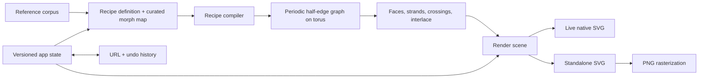

# Islamic Pattern Instrument v1

**Status:** Implemented locally on 2026-08-02; automated verification is green. Physical iOS/Android feel and final provenance-fidelity review remain human gates.

**Target repository:** `/Users/davidwilson/code/islamic-patterns` → `true-and-useful/islamic-patterns` (working name; verify availability before creation)

## Product intent

### Problem

A curious maker can admire Islamic geometric ornament online, but the common paths are static galleries, technical construction tools, or broad generators. None gives them the immediate feeling that a finished pattern is responding to their hand. The first version should solve that personal, tactile problem. It does not need to prove a market or a growth loop.

Evidence: the product conversation repeatedly returns to the first drag, continuous beauty, and felt authorship as the experience worth building.

**Context:**

- Prior ChatGPT conversation: https://chatgpt.com/c/6a6f7ceb-0488-83ea-8919-02d267ab0236
- Kaplan, *Islamic Star Patterns from Polygons in Contact*: https://cs.uwaterloo.ca/~csk/publications/Papers/kaplan_2005.pdf
- Kaplan's Islamic star-pattern work and software: https://cs.uwaterloo.ca/~csk/other/starpatterns/
- `robust-predicates` package documentation: https://www.npmjs.com/package/robust-predicates
- Local `true-and-useful` baseline: `/Users/davidwilson/code/leafmill/package.json`, `/Users/davidwilson/code/leafmill/.github/workflows/deploy.yml`
- Local visual-quality checklist: `/Users/davidwilson/conductor/workspaces/forkable-apps/valencia/docs/design-quality-checklist.md`

### High Level Approach

Build a quiet, full-screen web instrument that opens on a finished ornament. One direct gesture moves it through a deliberately curated range of coherent, beautiful states.

### Anecdotal signal

The experience is working if people make a distinct state, keep it, or send the living link to a friend, and the friend sometimes touches it rather than only looking. This is something to notice in conversation, not a funnel to instrument in v1.

### Scope

**In**

- A launch collection of at least three source-documented starting patterns. Each is a complete ornament with its own beautiful default and a curated morph range that is release-quality throughout, not merely an impressive thumbnail. Three is the launch floor, not a cap: the first proves the interaction, the easy/adversarial pair proves the architecture is not fitted to one case, and the third makes choosing a design feel like a collection rather than a comparison demo.
- An elementary case and an adversarial flagship case. The flagship must require more than the elementary regular-polygon, single-angle construction.
- One shared recipe vocabulary sized by what those references need. The kernel may support several contact, inference, or pairing rules; the UI does not expose them.
- One curated morph axis per design. Each approved range has stable topology and contains no known ugly or invalid states.
- A continuous material axis from fine linework to convincing interlaced bands.
- Periodic correctness: seam wrapping, strands that cross the repeat cell, crossings, and faces represented on the torus.
- A few curated palettes; pan, zoom, undo, and reset.
- State in the URL; share/copy restores the exact living state.
- High-resolution PNG and appearance-grade SVG export.
- Mobile-device support for current iOS Safari and Android Chrome, including the full touch, edit, URL-copy, and export flow. Also include keyboard access, reduced-motion support, and a measured frame-rate budget.

**Out**

- Accounts, feed, prompt box, blank-canvas construction, arbitrary user-authored tilings, region editing, or tutorials.
- Randomize as the primary action.
- Mosaic and cut-screen rendering modes.
- Fabrication export profiles: kerf, tool paths, closed-cut polarity, island checks, and CNC/laser guarantees.
- Analytics, cohorts, funnel instrumentation, or conversion machinery.

**Cut**

- Eight tilings. The number was arbitrary and a tiling is not the product unit.
- Four separate render modes. The material axis covers the v1 visual transition.
- A fully general user-facing Hankin engine. Generality belongs in the kernel vocabulary, not the controls.
- A single elementary recipe assumed in advance for the whole collection.
- Fabrication-grade export. This does not cut periodic topology or appearance fidelity.

### User Experience

The page opens on a still, finished ten-point pattern. It is already worth looking at. Dragging across the pattern makes it breathe under the pointer or finger. The motion is immediate, reversible, and never falls into a broken state.

A compact set of controls changes the starting design, material, and palette. The user can explore the pattern at different scales, undo freely, save it as an image or vector, or copy a URL. Opening that URL restores the same design and view, ready to touch again.

### Acceptance Criteria

- **AC-1:** On the production build under the documented 1.6 Mbps down / 750 Kbps up / 150 ms latency / 4× CPU test profile, the first meaningful render contains a finished pattern within 1.5 seconds of navigation. No user action, setup, generator state, or empty application frame appears first.
- **AC-2:** Each starting pattern maps its user-facing `[0,1]` morph continuously into one connected validated range. A 512-point automated sweep records a normalized topology signature and geometric clearances at every sample. Any adjacent signature change or clearance below the warning threshold triggers recursive bisection to the configured parameter precision; the located event or suspect neighborhood is excluded with a safety margin. The range also passes the rendered contact-sheet review and a live end-to-end slow sweep with no known ugly state, seam break, jump, or visual pop. This is a pragmatic v1 guard, not a proof that no arbitrarily narrow event exists between samples.
- **AC-3:** The launch collection has at least three starting patterns, including one elementary case and one adversarial case that exercises richer recipe vocabulary. Each is a complete ornament with its own default and morph range. Each names its relationship to a documented source as `based on`, `adapted from`, or `inspired by`, and links to that source. Additional patterns ship only when they add a visibly different experience and pass the same checks.
- **AC-4:** The material control moves continuously from linework to interlaced bands. Strand continuation and over/under assignments remain consistent across repeat-cell seams and the full approved morph range.
- **AC-5:** Every approved state tiles seamlessly on screen. The periodic graph has valid half-edge twins, closed face cycles on the torus, and complete strand traversal across cell boundaries.
- **AC-6:** Undo, reset, pan, and zoom work without corrupting the design state. Pointer, touch, and keyboard users can operate the primary controls.
- **AC-7:** Copying a URL and opening it in a clean session restores the exact design, morph, material, palette, and normalized view. The recipient can continue editing from that state.
- **AC-8:** PNG and standalone SVG exports visually match the live composition at fixed test dimensions. SVG remains vector and makes no fabrication-readiness claim.
- **AC-9:** On the agreed reference iPhone, Android phone, and laptop, measure the idle display interval, run one warm-up morph sweep, then record a ten-second production sweep. The p95 application update duration stays below half the idle display interval; at least 95% of rendered-frame intervals stay below 1.5× that baseline; and no application update or traced main-thread task exceeds 50 ms.
- **AC-10:** The complete browse, morph, material, palette, pan/zoom, undo/reset, URL-copy, restore, PNG, and SVG flow works in current iOS Safari and Android Chrome in portrait and landscape. Controls have 44 px touch targets, respect safe areas, preserve native browser pinch zoom, survive 200% text zoom, and create no horizontal overflow or gesture trap.

---

## Summary

Build a small, public web instrument for touching a finished Islamic geometric ornament, moving it through a continuous range of beautiful states, and keeping or sharing the result. The work starts from a deliberately mixed reference corpus so the kernel grows around the flagship geometry instead of freezing around an easy demo.

## Solution

Use the reduced approach: select the corpus first, then create a new public repository in the `true-and-useful` organization with Vite, strict vanilla TypeScript, native SVG, Vitest, and a small Playwright suite. Keep the app entirely client-side. Start with a few broad source files and split them only when their size or responsibilities make the split useful.

The geometry kernel will compile declarative construction recipes into a periodic half-edge graph embedded on a repeat cell treated as a torus. That graph is the shared contract for faces, strand traversal, crossings, interlacing, rendering, and export. The recipe vocabulary is not designed up front. First, analyze the required launch set, then implement one elementary reference and one adversarial reference behind provisional builders that emit the same periodic-graph contract. Compare what they require, define the smallest shared vocabulary that fits the corpus, migrate them to data, and complete the launch collection. No kernel branch may switch on a design ID.

Live rendering and export use the same SVG. Morphing is limited to ranges whose dense topology and clearance sweep finds no event; a range with an observed or suspicious event is shortened rather than hidden behind repair code. Appearance-grade SVG preserves what the user sees. It does not promise editable construction semantics or fabrication-safe contours.

**Must include:**

- The easy-plus-adversarial build order before the recipe schema freezes.
- A periodic graph with seam-aware vertices and edges, half-edge twins, faces, strands, and crossings.
- Consistent interlacing across the repeat boundary.
- A deterministic, versioned app state shared by UI, URL, history, and export.
- One render path for live SVG, standalone SVG, and PNG rasterization.
- Automated invariant tests plus human review of the entire exposed visual range.
- No product analytics or server state.

## Architecture



### Core contracts

These names are provisional, but the boundaries are decisions.

```ts
type Vec2 = { x: number; y: number };
type LatticeOffset = { u: number; v: number };

type LatticeCell = {
  origin: Vec2;
  a: Vec2;
  b: Vec2;
};

type PeriodicVertex = {
  id: string;
  lineage: string; // stable construction identity, never derived from coordinates
  position: Vec2; // canonical coordinates inside one unit cell
};

type PeriodicHalfEdge = {
  id: string;
  origin: string;
  twin: string;
  next: string;
  wrap: LatticeOffset; // cell crossed while following this edge
};

type PeriodicCycle = {
  edges: readonly string[];
  netWrap: LatticeOffset;
};

type Crossing = {
  id: string;
  vertex: string;
  armsCCW: readonly [string, string, string, string]; // outgoing half-edge ids
  continuations: readonly [readonly [string, string], readonly [string, string]];
  overPair: 0 | 1;
};

type PeriodicGraph = {
  cell: LatticeCell;
  vertices: readonly PeriodicVertex[];
  halfEdges: readonly PeriodicHalfEdge[];
  faces: readonly PeriodicCycle[];
  strands: readonly PeriodicCycle[];
  crossings: readonly Crossing[];
};

type PatternDefinition = {
  id: string;
  reference: PatternReference;
  recipe: ConstructionRecipe;
  morph: MorphMap; // declarative curated parameter mapping, not arbitrary code
  defaults: DesignState;
  palettes: readonly string[];
};

type AppStateV1 = {
  v: 1;
  designId: string;
  morph: number;
  material: number;
  paletteId: string;
  view: { cx: number; cy: number; scale: number };
};
```

`ConstructionRecipe` is derived in U3. Candidate vocabulary includes contact placement, one- or two-point contacts, angle groups, inference passes, pairing rules, and local corrections. Only items demanded by the selected references enter the schema.

### Key decisions

1. **Corpus before schema.** Select the required launch references before fixing the recipe schema. The first implementation pair must include the easiest and hardest constructions.
2. **General kernel, bounded vocabulary.** Pattern definitions use the shared vocabulary. A future design may expose a missing construction idea and require a kernel extension. The plan does not pretend otherwise.
3. **Periodic topology is core.** The repeat cell is a torus, not a rectangle with duplicated edge art. Every geometric crossing is an explicit degree-four vertex in one planar periodic half-edge graph. Its crossing record names four outgoing arms in cyclic order, two continuation pairs, and the over pair. Faces follow half-edge `next`; strands follow crossing continuations. The graph also owns the lattice basis, stable construction lineage, wraps, face cycles, and weave assignment. A half-edge's destination is derived from its twin; twins reverse both endpoints and wrap offsets.
4. **Fixed topology gets a pragmatic v1 guard, not a proof system.** For each design, sample the exposed range at 512 evenly spaced values and compare a deterministic topology signature plus minimum geometric clearances. Recursively bisect adjacent signature changes and low-clearance neighborhoods to the configured parameter precision, then remove a safety margin around anything suspect. Stable construction-lineage IDs and one deterministic torus-representative convention prevent coordinate wrapping from creating false changes. A human contact-sheet review and slow sweep remain required. Formal interval certification is an upgrade path only if this process misses a visible event.
5. **SVG first.** A single repeated SVG definition keeps the live DOM small and makes export parity achievable. The repeated cell includes a decoration halo made from neighboring lattice translations before clipping, so wide bands and wrapped crossings cannot reveal seams. Canvas is used only to rasterize the standalone SVG for PNG.
6. **Interlacing is geometry.** Crossing pairings and strand order live in the kernel. Stroke width and palette live in the renderer.
7. **History commits gestures, not frames.** Pointer movement previews state; pointer-up commits one undo entry. Undo is useful instead of containing hundreds of samples.
8. **URLs carry state, not history.** The versioned hash contains the current design and normalized view. It contains no user identity and needs no server.
9. **Native mobile zoom is the provisional bet.** Pinch remains a browser gesture. The artwork's default one-finger drag morphs; an explicit `Move view` control switches one-finger drag to application pan, and labelled controls change application zoom. U2 puts this crude interaction on real phones before the recipe compiler makes it load-bearing; a failed feel test stops the sequence and reopens the gesture model.
10. **Standalone means self-contained.** The SVG itself carries presentation attributes, dimensions, namespaces, definitions, and metadata. It does not depend on application CSS, CSS variables, inherited styles, fonts, or external assets.
11. **No polygon-boolean pipeline in v1.** Interlacing is rendered with layered strokes and gaps, while fabrication contours are out of scope. Clipper2 or an equivalent polygon-union dependency would add a second geometry regime without serving a v1 promise.

## Implementation

### U0. Select and document the reference corpus

- **Goal:** Choose a launch floor of three patterns and a broader reference shortlist that define the aesthetic bar and candidate recipe vocabulary before implementation begins.
- **Files:** Research may begin in the planning workspace; once U1 creates the repo, save the result as `docs/PATTERNS.md`. Add files to `public/references/` only when their licenses allow redistribution.
- **Approach:** Build a shortlist from primary papers, museum records, or documentation tied to an identifiable building/object. Score each candidate for visual quality, provenance strength, morph potential, periodicity, distinctness, and construction difficulty. Select a required launch set containing (a) one elementary regular-polygon case, (b) one flagship case that requires irregular supporting tiles, corrected contact placement, multiple contact groups, or richer inference, and (c) at least one visually distinct companion. Record the original place/object, date and region where known, source URLs, image rights, construction analysis, exact relationship label (`based on`, `adapted from`, or `inspired by`), and what must remain visually recognizable. Build a construction matrix for the required set and the strongest optional candidates. This lets the broader corpus pressure-test the vocabulary without committing every candidate to launch.
- **Verification:** At least three required entries have credible source links and pass a manual provenance review. The flagship demands at least one construction concept absent from the elementary case. Each companion adds a visibly distinct experience rather than another preset of the same pattern. No app copy claims exact reconstruction unless the evidence supports it. (covers AC-3)

### U1. Create the repository and browser baseline

- **Goal:** Establish a small public repo that matches `true-and-useful` conventions without inheriting server infrastructure.
- **Files:** `package.json`, `package-lock.json`, `tsconfig.json`, `vite.config.ts`, `playwright.config.ts`, `index.html`, `src/main.ts`, `src/styles.css`, `tests/`, `wrangler.jsonc`, `.github/workflows/ci.yml`, `.gitignore`, `README.md`, `docs/PATTERNS.md`, `AGENTS.md`, `LICENSE`
- **Approach:** Confirm the working name, create `/Users/davidwilson/code/islamic-patterns`, initialize `main`, and create a public `true-and-useful/islamic-patterns` remote. Scaffold the current Vite vanilla-TypeScript template with npm. Enable strict TypeScript, including unchecked-index protection. Configure Vitest through Vite and add `typecheck`, `test`, `test:e2e`, `build`, `dev`, and `deploy` scripts. Configure Cloudflare static assets only; do not add Hono or a Worker handler. One workflow runs install, typecheck, unit tests, build, and a Playwright smoke test, then deploys on `main` only after those checks pass.
- **Verification:** A clean clone passes `npm ci`, `npm run typecheck`, `npm test`, `npm run build`, and the smoke test. `npm run dev` serves a full-viewport placeholder. A preview deployment loads at `/` and with a hash. (foundation for all ACs)
- **Depends on:** U0

### U2. Build the minimum torus kernel against easy and adversarial cases

- **Goal:** Make the flagship break the abstraction before the recipe schema is fixed, without creating a disposable spike subsystem.
- **Files:** `src/geometry/types.ts`, `src/geometry/kernel.ts`, `src/patterns/<easy-id>.ts`, `src/patterns/<flagship-id>.ts`, `src/render.ts`, `src/interaction.ts`, `src/styles.css`, `tests/geometry.test.ts`, `docs/recipe-vocabulary.md`
- **Approach:** Define the permanent output contract: lattice basis and cell, lineage-stable canonical vertices, half-edges with reciprocal wrap invariants, face and strand cycles, and explicit degree-four crossing vertices. Each crossing records four outgoing arms in cyclic order, two continuation pairs that consume those arms exactly once, and the over pair. Faces use planar half-edge `next`; strands use continuation pairs. A half-edge destination resolves through its twin; storing it twice is forbidden. Implement the minimum vector and torus traversal needed to take both references through one thin path. Temporary pattern-specific builder functions may live in their eventual pattern files. Render one decorated repeat cell into native SVG and serialize that same live SVG for a standalone export. Add a deliberately crude mobile interaction shell: one-finger morph, native pinch, `Move view`, and labelled zoom buttons. Record every construction difference between the two patterns and compare it with the broader U0 analysis.
- **Verification:** Tests prove destination/twin consistency, reciprocal wraps, degree-four cyclic incidence, one-time continuation-pair consumption, closed torus faces, complete strand traversal, and crossing consumption. Both patterns render recognizably, tile in both lattice directions, produce consistent interlacing, and export from the same SVG. The adversarial case proves at least one vocabulary need absent from the elementary case. On one real iPhone and one real Android phone, use a thumb to traverse the flagship range, browser-pinch the page, enter and leave Move-view, pan, and use app zoom in both orientations. If this feels like operating controls rather than touching the pattern, traps native zoom, or requires awkward regripping, revise the gesture model and this plan before U3. (covers the risky core of AC-2, AC-4, AC-5, AC-8, AC-10)
- **Depends on:** U1

### U3. Derive and implement the recipe compiler

- **Goal:** Replace the temporary builders with the smallest declarative vocabulary justified by the required launch set and the broader corpus analysis.
- **Files:** `src/geometry/recipe.ts`, `src/validation.ts`, `src/patterns/<easy-id>.ts`, `src/patterns/<flagship-id>.ts`, `tests/geometry.test.ts`, `tests/patterns.test.ts`, `docs/recipe-vocabulary.md`
- **Approach:** Establish a provisional recipe schema only after U2; freeze it in U5 after the full launch collection works. It may include contact placement, one- or two-point contacts, angle groups, inference passes, pairing rules, or local corrections only when the U0 matrix and U2 implementations demand them. Morph maps are declarative curated mappings. Add `robust-predicates` for robust orientation signs rather than implementing them locally, and document its screen-coordinate/y-axis convention at the wrapper boundary. Define one small `ValidationTolerance` policy with dimensionally correct normalized thresholds for distance, edge length, clearance warnings, bisection precision, and exclusion margins. Compile scaffold plus recipe parameters into the U2 periodic graph. Derive primitive IDs from construction lineage, not coordinates. Give each design one deterministic torus-representative convention and normalize signatures before comparison. Migrate both pattern-specific builders to recipe data and delete the temporary functions. No compiler branch may inspect `designId`.
- **Verification:** Tests cover wrapped intersections, reciprocal twins, closed torus faces, crossing cyclic order, continuation pairs, wrapped strand walks, satisfiable/unsatisfiable weave cycles, equivalent torus representatives, robust-orientation wrapper semantics, and tolerance boundaries. At approved samples, coordinates are finite; edges exceed the minimum length; every half-edge belongs to one face; the cell decomposition has the expected Euler characteristic; and every strand/crossing occurrence is consumed once. Migrated output remains within U2's approved visual tolerance. (covers AC-4, AC-5)
- **Depends on:** U2

### U4. Finish the single SVG renderer and material axis

- **Goal:** Establish the final visual treatment before the complete launch collection is approved.
- **Files:** `src/render.ts`, `src/palettes.ts`, `src/styles.css`, `tests/render.test.ts`
- **Approach:** Mount one native SVG whose `<defs><pattern>` contains a decorated repeat cell and whose viewport is one filled rectangle. Update that same live SVG during morphs; export later by cloning it rather than rebuilding it through a second renderer. Render linework and bands as layered strokes. Use kernel crossing metadata to create underpass gaps and overpass segments, including wrapped crossings. Before clipping, emit neighboring lattice translations for every primitive whose maximum band, outline, or crossing-gap extent intersects the cell boundary; include corner neighbors and assert that the configured decoration radius is smaller than half the cell's shortest altitude. Use explicit SVG presentation attributes rather than application CSS or inherited variables. Mark `pattern-ready` when the default SVG is mounted. Add a static initial shell only if the measured first meaningful render misses AC-1.
- **Verification:** Representative screenshots across morph and material anchors pass on desktop and mobile. Edge and corner seams remain invisible at maximum material width and high zoom. The SVG element count is bounded by one decorated cell plus its finite halo rather than viewport size. Under AC-1's fixed network/CPU profile, `pattern-ready` occurs within 1.5 seconds and the first application render is the finished default. Cloning and serializing the live SVG preserves the image without app styles. (covers AC-1, AC-4, AC-5, AC-8)
- **Depends on:** U3

### U5. Complete the launch collection and freeze every exposed range

- **Goal:** Ship a real collection and freeze the vocabulary only after every included pattern works through the final renderer.
- **Files:** `src/patterns/<companion-id>.ts`, any optional `src/patterns/<additional-id>.ts`, `src/patterns/registry.ts`, `src/validation.ts`, `tests/patterns.test.ts`, `tests/e2e/contact-sheets.spec.ts`
- **Approach:** Express every launch pattern as recipe data plus a declarative curated morph map. The user-facing scalar may coordinate several recipe parameters. Implement enough companions to reach the launch floor. An additional pattern may ship when it adds a visibly different experience, uses the established vocabulary or a small concept already identified in U0, and can absorb the full verification cost. An unexpected construction system triggers an explicit scope review. For each candidate exposed range, run 512 uniform samples through all graph invariants, a normalized topology signature, and minimum-clearance measurements. Recursively bisect any interval whose endpoint signatures differ or whose samples approach the warning threshold. Exclude a configured safety margin around every located or unresolved suspect neighborhood. Each starting pattern exposes one connected validated range only; a disconnected range may appear only as a separately registered starting pattern that independently passes provenance, default-quality, distinctness, and verification gates. Separately, use Playwright to generate aesthetic contact sheets at 101 morph samples and material anchors.
- **Verification:** Every exposed range has a stored validation report containing its sampling resolution, normalized topology signature, minimum observed clearances, refined suspect intervals, and excluded margins. Tests prove the public `[0,1]` map is continuous and lands inside that one approved range. All graph invariants pass at all 512 samples and all refinement samples. A human signs off the contact sheets and a live slow sweep for each included pattern. The registry contains at least three starting patterns with no known unsafe interval. Every pattern beyond the floor has a recorded distinctness rationale and passes the same checks. (covers AC-2, AC-3, AC-4, AC-5)
- **Depends on:** U4

### U6. Implement direct manipulation, controls, and history

- **Goal:** Make the pattern feel causal, immediate, and reversible on touch, pointer, and keyboard.
- **Files:** `src/state.ts`, `src/interaction.ts`, `src/ui.ts`, `src/styles.css`, `tests/state.test.ts`, `tests/e2e/interaction.spec.ts`
- **Approach:** Keep one `AppStateV1`. Horizontal one-pointer drag over the artwork adjusts morph. Native two-finger pinch remains browser zoom and is never cancelled. A clearly labelled `Move view` button switches one-finger artwork drag between morph and application pan; it uses `aria-pressed`, a strong visual state, and `Escape`/second tap to exit. Labelled `−`/`+` controls change application zoom. On desktop, wheel zooms around the pointer and `Space`+drag pans. At one-pointer gesture start, snapshot the committed state. If a second contact arrives or `pointercancel` fires, cancel the pending frame, restore the snapshot, append no history, release pointer capture, and yield immediately to native pinch. A compact labelled range mirrors morph for keyboard and assistive technology. Arrow keys adjust morph, `+`/`-` zoom, and `Cmd/Ctrl+Z` undoes. Gesture end commits one history entry. Controls use native elements with 44 px mobile targets and visible focus. Reset restores the selected design's default state. Opening remains still; reduced motion disables any non-input transition. Then run an explicit gesture-feel loop on the reference phones: tune drag-distance-to-parameter mapping, endpoint behavior, and sensitivity for both coarse travel and small adjustments. Keep input causal—no smoothing lag or ornamental easing between the finger and the pattern.
- **Verification:** Playwright covers mouse, keyboard, touch-emulated morphing, Move-view entry/exit, second-contact and `pointercancel` rollback with no history entry, undo after a long drag, reset, design switching, zoom around a focal point, portrait/landscape layout, and pan without accidental morph. Manual checks on iOS Safari and Android Chrome confirm native pinch zoom still works over the artwork without committing a partial app gesture, labelled controls have 44 px targets, safe areas are respected, and no mode or gesture traps the user. Subjective sign-off requires that a thumb can make a deliberate small change, cross the useful range without awkward regripping, reverse direction without lag, and approach either endpoint without the control feeling dead or twitchy in both portrait and landscape. (covers AC-1, AC-6, AC-9, AC-10)
- **Depends on:** U5

### U7. Add versioned URLs, living links, and export

- **Goal:** Preserve the exact result without accounts or a backend.
- **Files:** `src/state.ts`, `src/export.ts`, `src/ui.ts`, `tests/state.test.ts`, `tests/export.test.ts`, `tests/e2e/share-export.spec.ts`
- **Approach:** Encode a versioned state in the URL hash with `URLSearchParams`. Include design, morph, material, palette, and normalized view center/scale; omit history. Parse through a strict decoder that rejects unknown versions, defaults unknown IDs, clamps numeric values, and never feeds unchecked values to geometry. Update the hash with `replaceState` after committed changes. One action copies the current URL to the clipboard, with a selectable-text fallback when the Clipboard API is unavailable. Clone the live SVG into a self-contained document with explicit width/height, `viewBox`, namespace, definitions, presentation attributes, and metadata containing the reference relationship and source URL. Include no external stylesheet, CSS variable, inherited font, or network asset. Rasterize that exact SVG in-browser to one documented high-resolution PNG size, capped at 4096 px on its longest edge. Revoke object URLs after download.
- **Verification:** Property tests round-trip valid state and safely handle malformed hashes. A clean browser context restores the exact visual state and remains editable. Playwright downloads SVG and PNG, checks MIME type and dimensions, opens the serialized SVG in an isolated document with no application stylesheet or network access, and compares it with the live composition at fixed dimensions. For every design default plus representative morph/material stress states, decode the downloaded PNG and pixel-compare it with a browser raster of the same live SVG using fixed dimensions, device pixel ratio, color space, background, and a documented antialiasing tolerance. Manual iOS Safari and Android Chrome checks verify URL copy/fallback, state restore, and both export paths. (covers AC-7, AC-8, AC-10)
- **Depends on:** U6

### U8. Close the visual, accessibility, performance, and launch gates

- **Goal:** Ship only after the whole exposed surface has been reviewed on real devices.
- **Files:** `tests/e2e/visual.spec.ts`, `tests/e2e/accessibility.spec.ts`, `docs/QA.md`, `README.md`, `.github/workflows/ci.yml`
- **Approach:** Run a small representative golden set at iPhone, Android phone, laptop, and ultra-wide sizes; the contact sheets remain the full-range visual check. Test portrait and landscape, reduced motion, contrast, 200% text zoom, keyboard-only operation, malformed URLs, and export failures. For AC-9, load the production build, measure the median idle `requestAnimationFrame` interval, run one warm-up sweep, then record a ten-second sweep. Measure each application update inside its callback and record rendered-frame intervals. Use `PerformanceObserver` for long tasks when available and a browser performance trace otherwise. Render at most once per animation frame, then optimize only measured bottlenecks. Document the exact devices, browsers, build SHA, measurement command, raw results, supported mobile browsers, provenance model, controls, export limits, and non-fabrication guarantee.
- **Verification:** CI is green from a clean checkout. The complete topology-validation reports and 101-sample contact sheets have final sign-off. On every reference device, p95 update duration is below half the idle frame interval, at least 95% of frame intervals are below 1.5× baseline, and no update or traced task exceeds 50 ms. The full mobile matrix passes AC-10. The production URL passes AC-1 through AC-10, and the SVG metadata/source links are correct for every included pattern. (covers AC-1 through AC-10)
- **Depends on:** U7

## Delivery sequence

1. **Risk retirement and stop gate:** U0–U2. End with recognizable easy and flagship patterns going through a thin live-and-export path and a crude interaction proven on real phones. U0–U2 are authoritative; U3–U8 remain directional until this gate passes. If the flagship geometry, interlacing, or gesture model fails, revise the later plan before continuing.
2. **Kernel and collection confidence:** U3–U5. End with the recipe vocabulary frozen by evidence and every launch range fully audited through the final material renderer.
3. **Instrument:** U6. End with the complete tactile and reversible interaction.
4. **Artifact:** U7. End with living links and matching image/vector exports.
5. **Launch:** U8. End with real-device performance and production deployment.

Do not start design polish before U2's adversarial case works. Reach the three-pattern launch floor before considering optional additions. Extra patterns must pay the same verification cost and add a visibly different experience.

## Testing

The testing strategy has three layers:

1. **Mathematical invariants:** deterministic unit tests over periodic topology, face and strand traversal, crossing consistency, state decoding, and export structure.
2. **Finite verification surface:** a 512-point topology-and-clearance sweep plus targeted bisection guards the exposed range; 101-point contact sheets and live sweeps cover aesthetics. This deliberately accepts the residual risk of an event that appears and disappears entirely between samples. Escalate to interval certification only if a contact sheet, live sweep, or shipped state exposes a miss.
3. **Product behavior:** Playwright covers the real gesture, history, URL, share, and export paths at representative viewport sizes. Final performance and Safari/iOS checks run on real hardware.

Golden screenshots are limited to representative states. They do not replace the dense contact-sheet review.

## Open questions

- **Working name:** `islamic-patterns` is descriptive, not a product-name decision. Confirm the repo slug before U1.
- **Reference corpus:** the required launch set and strongest optional candidates are intentionally decided in U0. Choosing them is architecture work, not content polish.
- **Reference devices:** name one actual iPhone, one Android phone, and one laptop before AC-9 and AC-10 are measured. A remote-device service may stand in when physical Android hardware is unavailable, but touch emulation alone is not the final mobile check.
- **Collection growth:** three is the launch floor because it creates meaningful choice after the easy/adversarial pair. It is not a cap. Optional patterns must add a distinct visual experience and pass the same full-range review.

## Alternatives considered

| Approach | What it is | Trade-off | Why rejected |
|---|---|---|---|
| Pre-split modules and separate spike infrastructure | Create dedicated spike folders, DOM/string renderers, many geometry modules, separate CI/deploy workflows, and duplicated specs up front | Cleaner-looking architecture before implementation | It adds files and migration work before the adversarial pattern proves which boundaries matter. The chosen plan keeps the same checks with fewer concepts. |
| One elementary recipe across the collection | Assume the same single-angle construction covers every launch pattern | Small schema and low initial build effort | It tests the abstraction only against cases it already fits and may exclude or flatten the flagship Persian family. |
| Fully general Hankin/tiling engine first | Model arbitrary tilings, construction rules, and topology before selecting references | Broad future capability | The schema would be speculative and the verification surface unbounded. |
| Ad hoc interpolated SVGs | Hand-author each launch pattern as a fixed-topology path system with no recipe compiler | Smallest implementation diff | It cannot support the agreed general kernel, honest construction semantics, or shared periodic/interlacing validation. |
| Canvas/WebGL live renderer plus separate SVG exporter | Optimize the screen and export independently | Potentially higher raw rendering headroom | Two render paths make visual parity harder and are unnecessary for one repeated cell. |
| React application | Use component state and a UI runtime | Familiar component model | The app has one canvas, a compact control set, and no server data. Vanilla TypeScript keeps the bundle and state flow smaller. |
| Formal interval topology certification in v1 | Declare per-operation proof obligations, conservatively bound every geometric predicate, isolate roots, and store certificates | Stronger assurance between samples | The certifier would become the largest and most subtle verification surface in a beauty project. Dense sampling, bisection, safety margins, and human sweeps are proportionate; formal proof remains an upgrade path after an observed miss. |
| Polygon booleans with Clipper2 | Expand and union strand contours before rendering | Useful for fabrication-grade closed shapes | Layered SVG strokes and crossing gaps satisfy appearance-grade interlacing, while fabrication is explicitly out of scope. |
| Fabrication-grade SVG | Expand/union contours and validate manufacturing constraints | Serves CNC and laser workflows | It is a different audience and verification regime. V1 promises only visual fidelity. |
